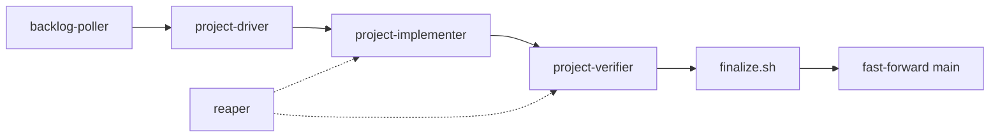

# CAO backlog loop

A self-contained pattern for working a committed backlog unattended on
[CLI Agent Orchestrator](https://github.com/awslabs/cli-agent-orchestrator) (CAO). `backlog/` is the
queue, [Backlog.md](https://github.com/MrLesk/Backlog.md) is its provider, and this directory is the
orchestration around it. Nothing here is project-specific; the only things to adjust for a new
project are listed under [Adapting it](#adapting-it).

## What it does

CAO polls ready `To Do` tasks and runs each one through `implement → verify → finalize`. A task
reaches `Done` only after an independent verifier passed every acceptance criterion and `task ci`
passed on the exact commit that is about to land.



## Layout

```text
cao/
  Taskfile.yaml      task cao:* facade: install, server, schedules, status
  agents/            CAO agent profiles: driver, implementer, verifier
  flows/             Scheduled flows: backlog poller and reaper
  scripts/
    tracker.sh       The only production entry point for the Backlog.md CLI
    drive-task.sh    One task, one attempt: lock, claim, worktree, phases, finalize
    launch-phase.sh  Launch and supervise one phase terminal to a durable outcome
    repo-state.sh    Locks, attempt worktrees, repository digest, phase artifacts
    finalize.sh      Validate artifacts, commit, gate, fast-forward, checkpoint
    retry-state.py   Atomic task-keyed retry, finalization, and delivery state
    reap.py          Shut down only stale terminals this repository registered
    notify.sh        Best-effort Pushover notification, silent without credentials
  tests/             Deterministic tests for every safeguard above
```

Runtime state is machine-local and gitignored: `.cao/` holds the lock, CAO home, per-attempt work
directories, and checkpoints; `.worktrees/` holds per-attempt Git worktrees.

## Setup

```sh
task init          # toolchain, including uv and the pinned Backlog.md CLI
task cao:install   # install CAO and the three agent profiles
task cao:up        # start the local CAO server and enable the schedules
task cao:status    # schedules, sessions, and runtime-flow health
task cao:down      # stop this project's CAO sessions and server
```

Day to day:

```sh
task backlog       # the committed work queue
task cao:next      # the next dependency-ready task, without mutating anything
task standup       # what landed, what is blocked, what needs the owner
task cao:dashboard # the local CAO dashboard
```

## Selection rules

A task is ready when it is `To Do`, carries none of `container`, `human`, `deferred`, `blocked`, or
`escalated`, and every dependency is `Done`. Ready tasks sort by priority (High, Medium, Low), then
`ordinal`, then ID. `cao/flows/next-task.sh` refuses to dispatch unless the primary checkout is on
`main`, no repository lock exists, no task is already `In Progress`, and fewer than six attempts have
started in the last rolling hour.

`tracker.sh` is the only thing that talks to the `backlog` CLI. Never edit task Markdown directly and
never build a second queue beside it.

## Attempt identity

A dispatched task has one stable Backlog ID and a fresh unique attempt root per try. The attempt root
names its `.worktrees/<attempt>` worktree, its `cao/<attempt>` branch, and its `.cao/work/<attempt>`
artifacts. Retry state is keyed by task ID at `.cao/state/tasks/<ID>/checkpoint.json`. An attempt root
is never reused as a task identity, so every retry stays independently inspectable.

## The lifecycle

1. **Drive.** `drive-task.sh` acquires `.cao/repository.lock`, records the task ID plus a live CAO
   terminal, claims the task, and creates an attempt worktree from the locked baseline SHA.
2. **Implement and verify.** Each phase runs in its own CAO session against the attempt worktree and
   writes a structured artifact through `repo-state.sh write-artifact`. Neither phase commits, and
   neither mutates provider state. The baseline SHA, content digest, and changed-file list are
   computed from the repository rather than transcribed by a model, so cross-phase agreement is
   structural.
3. **Finalize.** `finalize.sh` validates both artifacts, rejects them if they observed different
   repository states, prepares `Done` in the attempt worktree, commits code and task together, runs
   `task ci` on that commit, then fast-forwards `main` only if it has not moved.
4. **Account.** After integration it records a delivery checkpoint and removes only a successful
   attempt's worktree and branch. A failed attempt keeps both as recovery evidence and releases the
   lock.

Either way, the primary checkout is left clean. The provider rewrites the task file there when the
claim is released — the failure note and the restored status — so finalization commits that one file
on the failure path and restores it to reviewed bytes on the success path. Otherwise the next
attempt's fast-forward is refused on a path nobody owns. No other file in the owner's checkout is
ever touched.

Never put a delivery commit SHA in the committed task summary: changing that text changes the commit.
Delivery proof belongs in the checkpoint and in Git.

## Failure handling

- **Retry budget.** At most three identical failure fingerprints or six total task failures. Provider,
  terminal, lock, and checkout-control failures are infrastructure and do not consume that budget.
- **Escalation.** Exhausted budget, `waiting_user_answer`, or a phase timeout marks the task
  `escalated` with a structured reason and notifies best-effort. Escalated tasks leave the queue.
- **Blocking.** `tracker.sh block <ID> --class <credentials|account|payment|decision|upstream|gate>`
  is only for a world that must change. Weak task text, a stale path, an unknown command, or a
  failing check is work, not a blocker.
- **Locks.** The lock serializes mutation but does not require a clean owner checkout — attempts work
  in their own worktrees. Reconciliation asks the local CAO API about the recorded terminal and fails
  closed when the terminal ID or the API is unavailable. A lock is never stolen.
- **Reaping.** `reap.py` shuts down only terminals this repository registered in
  `.cao/state/events.jsonl`, and keeps anything that is live, waiting on a user, backed by a live tmux
  session, or whose worktree digest has changed.

## Task readiness

Refinement is the intake boundary; workers do not plan after dispatch. Before a task is ready it must
state outcome, scope, non-goals, and its exact modified-file contract, and give every acceptance
criterion a locally executable command with an expected result. Code presence, future CI, and "should
work" are not evidence. Model prerequisites as dependencies rather than prose, and keep the graph
acyclic. A task touching a protected gate file is not ready until the owner labels it `tooling`.

## Adapting it

1. `backlog/config.yml` — set `project_name` and `task_prefix`, and keep the label taxonomy in sync
   with the lanes this repository actually has.
2. `cao/scripts/repo-state.sh` — set `linked_caches` to the gitignored build/dependency caches that
   should be symlinked into each attempt worktree so `task ci` stays warm.
3. `cao/Taskfile.yaml` — choose the provider per profile in `install`, and change `CAO_API_PORT` if
   9889 is taken.
4. `cao/agents/*.md` — pick the model per phase. Different providers for implement and verify is
   deliberate: it keeps verification genuinely independent.
5. `CAO_PROJECT_NAME` — override the notification title; it defaults to the repository directory name.

## Tests

```sh
task cao:test    # deterministic tests
task cao:check   # shell syntax, tests, and profile validation when CAO is installed
```

The tests cover the safeguards that are expensive to rediscover: lock ownership and reconciliation,
attempt worktree isolation, tracker selection and dependency skipping, finalizer behavior when the
lock is lost, retry-checkpoint monotonicity with idempotent delivery, and fail-closed reaping.
